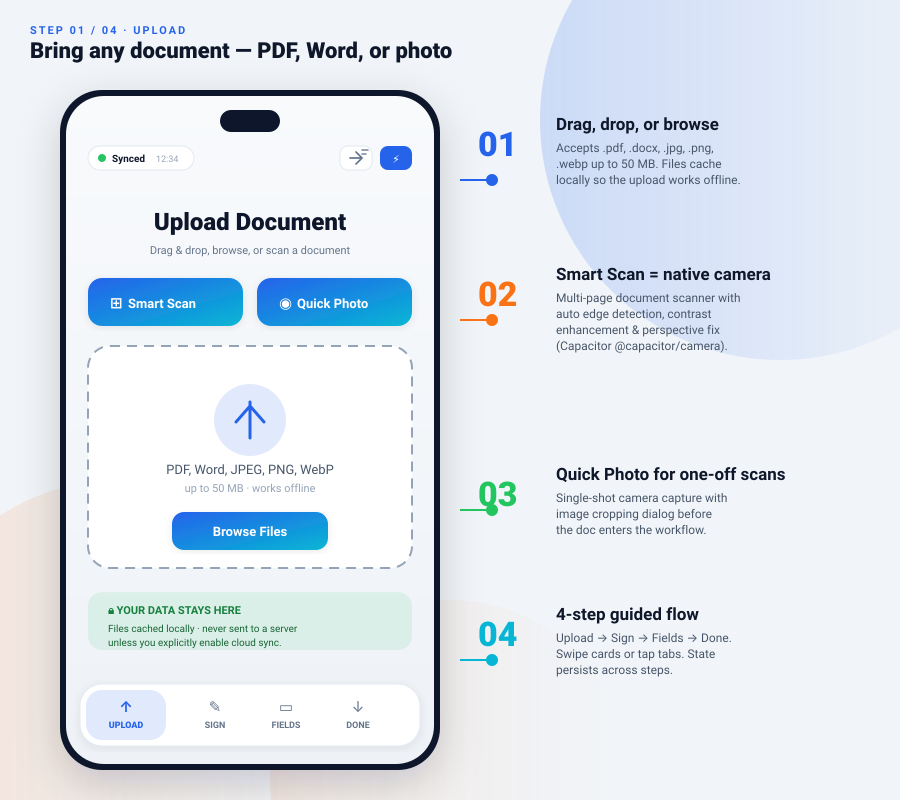
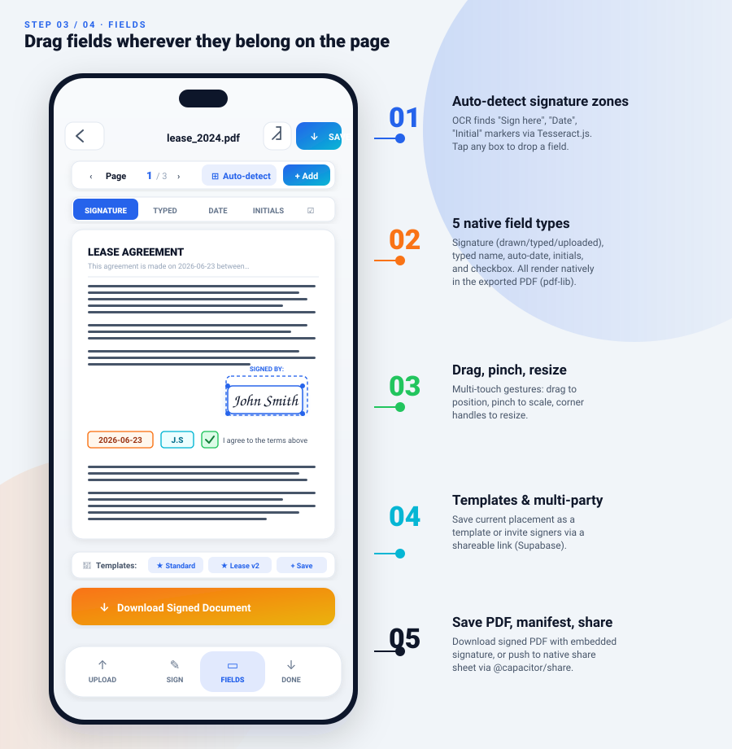
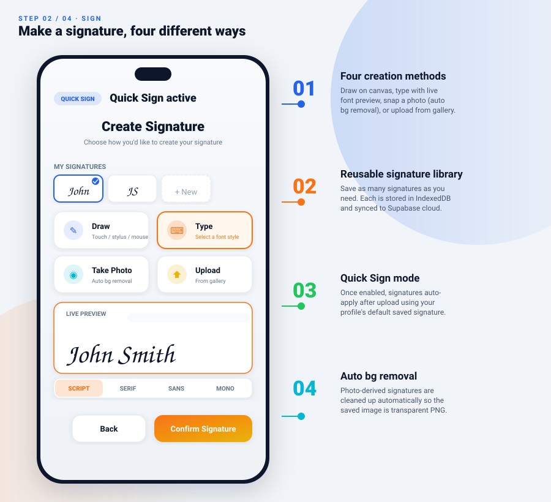
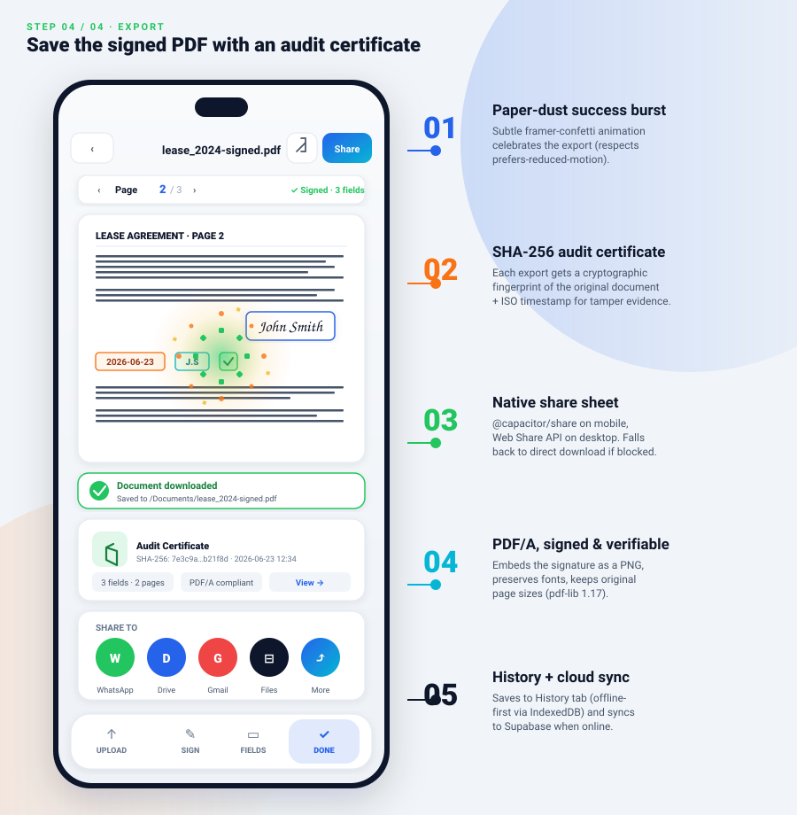

# SignDocu — Visual Walkthrough

An annotated tour of the four-step signing flow, paired with rendered SVG mockups in [`screenshots/`](../screenshots/).

Each section below corresponds to one `.svg` file. The images are intentionally stylized rather than real captures — they read cleanly on GitHub, stay diffable, and don't ever go stale from a running build.

> **Note:** SignDocu signatures are **not** legally binding under eIDAS, ESIGN, or UETA. The screens below show internal approvals, mockups, and personal-doc workflows.

---

## ① Upload — [`screenshots/01-upload.svg`](../screenshots/01-upload.svg)



**Where this comes from:** `src/components/DocumentUpload.tsx`, `src/pages/Index.tsx` (the `upload` step).

| Callout | Component | Behavior |
|---|---|---|
| ① Drag-drop / file picker | `motion.div` with dashed border + `<input type="file">` | Accepts `.pdf`, `.docx`, `.jpg`, `.jpeg`, `.png`, `.webp`, `.bmp`, `.tiff`. Files up to 50 MB. Validates MIME type on drop, falls back to `application/pdf` or `image/*`. Validates `.docx` via `isDocxFile()` (`src/lib/docxConverter.ts`). |
| ② Smart Scan | `handleSmartScan` → `@capacitor/document-scanner` | Multi-page native document scanner. Auto edge detection, perspective correction, contrast enhancement. Produces a `Blob` per page. Currently uses `@capacitor/camera` + crop dialog as web fallback. |
| ③ Quick Photo | `handleScanDocument` → `@capacitor/camera` | Single-shot capture, then routed through `ImageCropDialog` so the user can trim before signing. |
| ④ 4-step guided flow | `ActionBar.tsx` + `StepIndicator.tsx` | Bottom navigation tracks the user. Swipe between steps (`pageVariants` spring physics) or tap a tab. State persists across steps via `Index.tsx` local state. |

**Privacy hint card** ("🔒 YOUR DATA STAYS HERE") is rendered as a static decoration in `DocumentUpload.tsx` and reinforced as a one-time toast on first mount (`🔒 Your documents stay on your device`). Files are cached to the Cache API + IndexedDB via `cacheDocument()` (`src/lib/offlineMode.ts`), so re-running the app offline finds them instantly.

**Network status chip** (top-left "Synced" badge with green dot): driven by `onOnlineChange()` and reflects the current state of `navigator.onLine`. Cloud sync uses exponential-backoff `syncQueue.ts` — never blocks the upload UX.

---

## ② Place fields — [`screenshots/02-place.svg`](../screenshots/02-place.svg)



**Where this comes from:** `src/components/DocumentViewer.tsx`, `DocumentRenderer.tsx`, `SignaturePlacementLayer.tsx`, `useSignaturePlacement.ts`, `src/lib/pdfSigner.ts`.

| Callout | Hook / library | Behavior |
|---|---|---|
| ① Auto-detect signature zones | `src/lib/ocrFields.ts` (Tesseract.js) | Lazy-loads `tesseract.js` (~3 MB) on first scan. Detects "Sign here", "Signature", "Date", "Initials" markers. Outputs `DetectedField[]` with `(page, x, y, width, height)` in rendered-screen coordinates. |
| ② Five native field types | `src/lib/pdfSigner.ts` (`FieldType = 'signature' \| 'typed' \| 'date' \| 'initials' \| 'checkbox'`) | All five render as native PDF objects in the export — actual PDF signatures, real text fields, real checkboxes (`pdf-lib` AcroForm when supported, PNG fallback for legacy viewers). |
| ③ Drag, pinch, resize | `useSignaturePlacement` (`src/hooks/useSignaturePlacement.ts`) | Single-touch drag, two-finger pinch zoom, NVIDIA-style corner resize handles, double-tap to delete. Coordinates live in **wrapper pixels** — the wrapper is rendered 1:1 with the PDF `<Page width={pageWidth}/>` so coords round-trip to the export without scale distortion. |
| ④ Templates & multi-party | `src/lib/templateStorage.ts` + `src/lib/multiPartySigning.ts` | Repeatable placements stored in IndexedDB. Multi-party mode generates a `shareToken` URL; recipients add as participants, each with an assigned color. Supabase RLS keeps each session private to its participants. |
| ⑤ Save PDF / share | `src/lib/documentActions.ts` → `@capacitor/filesystem` + `@capacitor/share` | Native share sheet on mobile, Web Share API on desktop, plain download as fallback. |

**Critical mobile detail:** the wrapper div and the PDF `<Page>` canvas are sized identically (`pageWidth = containerRef.current.clientWidth`, clamped to `window.innerWidth` with `DESKTOP_CAP = 800`, monitored by a `ResizeObserver`). Earlier versions subtracted padding and tracked only `window.resize`; on a 360 px mobile screen that gap was ~10 % of the viewport, making every signature drift visibly. The fix lives in `DocumentViewer.tsx`.

**DocumentFoldIn** animation wraps the entire `<Card>` — paper-folds in on document-load success to reinforce the opening-of-paper metaphor.

---

## ③ Create signature — [`screenshots/03-sign.svg`](../screenshots/03-sign.svg)



**Where this comes from:** `src/components/SignatureCreator.tsx`, `src/lib/backgroundRemoval.ts`, `src/lib/signatureStorage.ts`, `src/lib/utils.ts` (`renderTypedSignature`).

| Callout | Method | Implementation |
|---|---|---|
| ① Four creation methods | Draw · Type · Photo · Upload | Draw uses `react-signature-canvas` (HTML5 canvas, touch + stylus). Type uses Canvas 2D with `Brush Script MT`, cursive, or system fonts. Photo + Upload both run through `removeBackground()`. |
| ② Reusable signature library | `src/lib/signatureStorage.ts` | IndexedDB primary, Supabase secondary. Each signature is a `SavedSignature { id, dataUrl, label, createdAt, syncStatus }`. The picker shows a horizontal scroller; clicking sets it active instantly. |
| ③ Quick Sign mode | Toggle via `ActionBar.tsx` ⚡ button | When enabled, the user uploads a document → it routes through `handleQuickSignNow()` in `Index.tsx` → signature auto-applies at the first detected zone. Requires `displayName` in the user profile (`userProfile.ts`). |
| ④ Auto background removal | `src/lib/backgroundRemoval.ts` | Color-distance threshold + alpha cutoff on a downscaled canvas — no ML model, ~150 ms typical. Falls back to the original photo on failure (shown via toast). |

**Font selector** uses the user's `preferredFont` from profile settings. `renderTypedSignature()` returns a `data:image/png;base64,…` PNG so the signature is composited transparently in the PDF export.

---

## ④ Export / download — [`screenshots/04-export.svg`](../screenshots/04-export.svg)



**Where this comes from:** `src/lib/pdfSigner.ts`, `src/lib/auditTrail.ts`, `src/lib/documentActions.ts`, `src/components/animations/SuccessBurst.tsx`.

| Callout | Mechanism | Behavior |
|---|---|---|
| ① Paper-dust success burst | `SuccessBurst.tsx` | 32-particles `framer-motion` overlay, ~600 ms, three-color palette (green / amber / orange). Triggered via `setSuccessBurstActive(true)` after a successful download. Respects `prefers-reduced-motion`. |
| ② SHA-256 audit certificate | `src/lib/auditTrail.ts` | Computes a hash of the original document bytes + JSON metadata (`{ signedAt, pageCount, fieldCount, signerId }`). Surfaced as a mini-card under the export so the user can copy the fingerprint for verification later. Not legally binding; included as a tamper-evident checksum. |
| ③ Native share sheet | `src/lib/share.ts` + `@capacitor/share` | On Capacitor: pulls the OS share sheet (WhatsApp, Drive, Files, mail, etc.). On web: Web Share API where supported, copy-to-clipboard + plain download otherwise. |
| ④ PDF/A, signed &amp; verifiable | `pdf-lib` (`PDFDocument.embedPng`) | Original page sizes preserved, signature image embedded as PNG, fonts left intact. Optional AcroForm checkboxes when the source supports them. |
| ⑤ History + cloud sync | `src/lib/documentHistory.ts` | Each completed export pushes a record (`{ userId, fileName, pageCount, fieldCount, signedAt, hash }`) to Supabase. Offline queue (`syncQueue.ts`) replays on reconnect with exponential backoff (1 s → 2 s → 4 s … capped at 60 s). |

**DocumentFoldIn** doesn't fire on the export step (only on the first document load) to avoid the animation repeating on every export.

**Multi-party note:** when the current recipient's color is set, the placed signature gets a thin border in that color so the user can visually validate "I'm placing for X, not Y" before continuing to the next recipient.

---

## Color tokens used

All screenshots use the same Tailwind tokens as the live UI (defined in `src/index.css`):

| Token | HSL | Hex | Used for |
|---|---|---|---|
| `--primary` | `217 91% 60%` | `#2563eb` | Buttons, tabs, primary CTAs |
| `--secondary` | `199 89% 48%` | `#06b6d4` | Secondary buttons, info chips |
| `--accent` | `25 95% 53%` | `#f97316` | Download CTA, date fields, accent pills |
| `--success` | `142 71% 45%` | `#22c55e` | Success burst, online chip, audit cert |
| `--warning` | `38 92% 50%` | `#eab308` | Burst accent particles, multi-party tab |
| `--destructive` | `0 84% 60%` | `#ef4444` | Lock badge, error toasts |
| `--background` | `210 40% 98%` | `#f8fafc` | Page background |
| `--foreground` | `222 47% 11%` | `#0f172a` | Body text, phone frame |

Dark-mode tokens live in the `.dark` block of `src/index.css` — flip theme in the top-right moon button to verify parity.

---

## How to regenerate from a running build

The four `.svg` files are hand-authored rather than captured from a live session. If you want real screenshots instead:

```bash
npm run dev
# in another terminal, spawn browser-use on http://localhost:8080 to walk the flow:
#   1. drag any PDF onto the drop zone
#   2. tap Draw → scribble a signature → Save
#   3. tap Fields → choose Signature → tap on the doc
#   4. tap the orange Download CTA → confirm toast
```

Capture each step into `screenshots/0{1..4}-step.png` to replace the SVGs. The README's relative paths stay valid either way.

---

## See also

- [`README.md`](../README.md) — top-level project documentation, embeds these four screens in its Visual Tour section
- [`SPECS.md`](./SPECS.md) — full feature spec and roadmap
- [`design/`](./design/) — implementation plans and design rationale referenced by the current codebase
